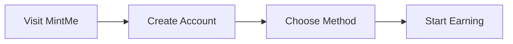

<div align="center">

[](https://github.com/TAHCOINBLOCKCHAIN/Earn-Without-Doing-anything/stargazers)
[](https://github.com/TAHCOINBLOCKCHAIN/Earn-Without-Doing-anything/network/members)
[](https://github.com/TAHCOINBLOCKCHAIN/Earn-Without-Doing-anything/issues)
[](https://github.com/TAHCOINBLOCKCHAIN/Earn-Without-Doing-anything/blob/main/LICENSE)

</div>

<p align="center">
  
  
  
</p>

<p align="center">
  <a href="#-getting-started"></a>
  
  <a href="https://github.com/TAHCOINBLOCKCHAIN"></a>
</p>

<div align="center">
  
[](https://visitorbadge.io/status?path=TAHCOINBLOCKCHAIN%2FEarn-Without-Doing-anything)
[](https://github.com/TAHCOINBLOCKCHAIN/Earn-Without-Doing-anything/graphs/contributors)
[](https://github.com/TAHCOINBLOCKCHAIN/Earn-Without-Doing-anything/graphs/commit-activity)

</div>

<h1 align="center">
  🌟 Earn Without Doing Anything 🌟<br>
  <sub>Your Gateway to Passive Cryptocurrency Income</sub>
</h1>

<p align="center">
  <b>Earn cryptocurrency while browsing, watching videos, or staying idle online - No investment required!</b>
</p>

<div align="center">
  
[](./README_Ar.md)
[](./README_Jp.md)
[](./README_Zh.md)
[](https://mintme.free.nf)
[](https://mintme.free.nf)

</div>

<p align="center">
  <a href="#-features">Features</a> •
  <a href="#-getting-started">Getting Started</a> •
  <a href="#-benefits">Benefits</a> •
  <a href="#-earning-tips">Earning Tips</a> •
  <a href="#-links">Links</a>
</p>

---

<details>
<summary>📚 Table of Contents</summary>

- [🎯 What is MintMe?](#-what-is-mintme)
- [✨ Features](#-features)
- [🚀 Getting Started](#-getting-started)
- [💎 Benefits](#-benefits)
- [📈 Earning Tips](#-earning-tips)
- [🔗 Important Links](#-important-links)
- [⚠️ Disclaimer](#️-disclaimer)
- [📜 License](#-license)
- [👥 Contributors](#-contributors)

</details>

## 🎯 What is MintMe?

MintMe is an innovative platform that revolutionizes the way you earn cryptocurrency through:

| Method | Description |
|--------|------------|
| 🌐 Web Browsing | Earn while surfing your favorite websites |
| 📺 Video Watching | Get paid for watching content |
| 💻 Idle Earning | Generate income by staying online |

## ✨ Features

<table>
  <tr>
    <td align="center">💰 No Investment</td>
    <td align="center">⚡ Instant Payments</td>
    <td align="center">🆓 Zero Fees</td>
  </tr>
  <tr>
    <td align="center">Start earning immediately<br>without capital</td>
    <td align="center">Receive rewards<br>instantly</td>
    <td align="center">No hidden charges<br>or costs</td>
  </tr>
</table>

## 🚀 Getting Started

<div align="center">



</div>

1. 🌐 Visit [MintMe Free](https://mintme.free.nf)
2. 📝 Create your account
3. 🎯 Select your earning method:
   - `🔍 Browse websites`
   - `🎥 Watch videos`
   - `💤 Stay idle while connected`

## 💎 Benefits

<div align="center">

| 🔄 Passive Income | 🤝 User-Friendly | 🔒 Secure Platform | 🎯 Multiple Options |
|------------------|------------------|-------------------|-------------------|
| Earn while doing regular activities | Easy to use for everyone | Safe & reliable environment | Choose your preferred method |

</div>

## 📈 Earning Tips

> 💡 **Pro Tips for Maximum Earnings**

- ⏰ Maintain consistent daily activity
- 🔄 Diversify your earning methods
- ✅ Complete tasks regularly
- 💻 Keep your browser active
- 📊 Track your earnings progress

## 🔗 Important Links

<div align="center">

[](https://mintme.free.nf)
[](https://mintme.free.nf)
[](https://github.com/TAHCOINBLOCKCHAIN/Earn-Without-Doing-anything/wiki)

</div>

## ⚠️ Disclaimer

```
While this platform offers legitimate opportunities for passive income, 
actual earnings may vary based on factors including:
- Activity levels
- Geographic region
- Available tasks
- Platform usage
```

## 📜 License

This project is licensed under the MIT License - see the [LICENSE](LICENSE) file for details.

## 👥 Contributors

<div align="center">
  
Thanks to all our contributors!

[](https://github.com/TAHCOINBLOCKCHAIN/Earn-Without-Doing-anything/graphs/contributors)

</div>

<div align="center">

---

<sub>Last updated: 2025-06-28 08:30:54 UTC</sub>

<sub>Made with ❤️ by [@TAHCOINBLOCKCHAIN](https://github.com/TAHCOINBLOCKCHAIN)</sub>

**Keywords**: `passive income` • `cryptocurrency earnings` • `MintMe` • `free earnings` • `no investment` • `instant payments` • `online income` • `passive crypto earning` • `browse and earn` • `watch and earn`

<div align="center">
  
  
</div>

</div>
